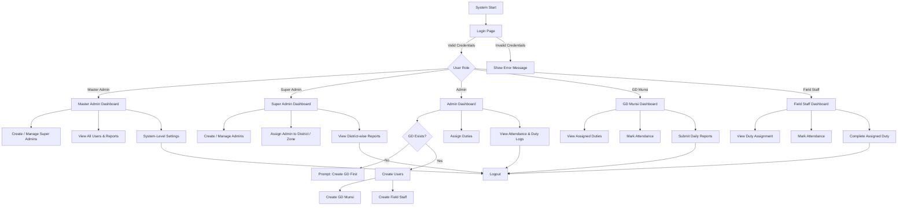

# police_Duty_management

```mermaid
flowchart TD
    A[System Start] --> B[Login Page]

    B -->|Valid Credentials| C{User Role}
    B -->|Invalid Credentials| B1[Show Error Message]

    C -->|Master Admin| D[Master Admin Dashboard]
    C -->|Super Admin| E[Super Admin Dashboard]
    C -->|Admin| F[Admin Dashboard]
    C -->|GD Munsi| G[GD Munsi Dashboard]
    C -->|Field Staff| H[Field Staff Dashboard]

    %% Master Admin Flow
    D --> D1[Create / Manage Super Admins]
    D --> D2[View All Users & Reports]
    D --> D3[System-Level Settings]

    %% Super Admin Flow
    E --> E1[Create / Manage Admins]
    E --> E2[Assign Admin to District / Zone]
    E --> E3[View District-wise Reports]

    %% Admin Flow
    F --> F1{GD Exists?}
    F1 -->|No| F2[Prompt: Create GD First]
    F1 -->|Yes| F3[Create Users]

    F3 --> F4[Create GD Munsi]
    F3 --> F5[Create Field Staff]
    F --> F6[Assign Duties]
    F --> F7[View Attendance & Duty Logs]

    %% GD Munsi Flow
    G --> G1[View Assigned Duties]
    G --> G2[Mark Attendance]
    G --> G3[Submit Daily Reports]

    %% Field Staff Flow
    H --> H1[View Duty Assignment]
    H --> H2[Mark Attendance]
    H --> H3[Complete Assigned Duty]

    %% Common Exit
    D3 --> Z[Logout]
    E3 --> Z
    F7 --> Z
    G3 --> Z
    H3 --> Z
```
