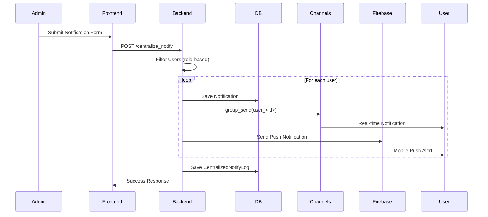
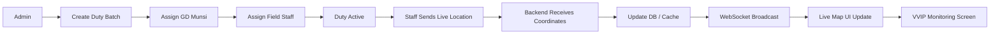
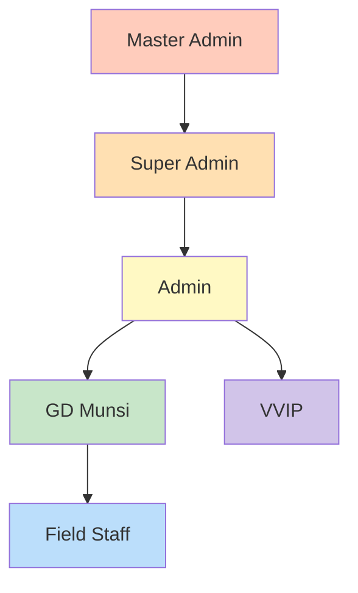
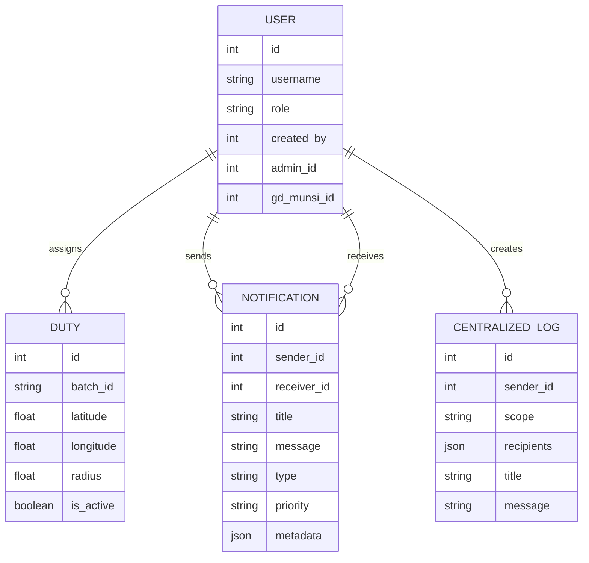
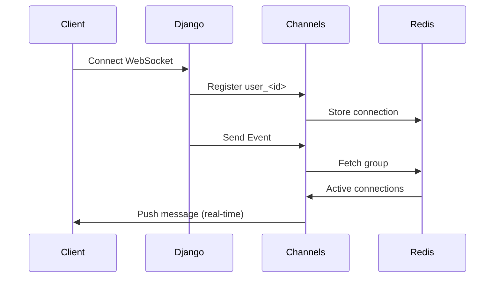

# 🚔 Police Duty Management System 2.0

A **role-based, real-time police duty management platform** designed to efficiently manage VVIP security, staff deployment, live tracking, and centralized communication across hierarchical roles.

---

# 📌 Table of Contents

* [Overview](#-overview)
* [Key Features](#-key-features)
* [System Architecture](#-system-architecture)
* [User Roles & Permissions](#-user-roles--permissions)
* [Core Modules](#-core-modules)
* [Real-Time Features](#-real-time-features)
* [Notification System](#-notification-system)
* [Database Design](#-database-design)
* [Installation Guide](#-installation-guide)
* [Usage Flow](#-usage-flow)
* [Security Features](#-security-features)
* [Future Enhancements](#-future-enhancements)
* [Tech Stack](#-tech-stack)

---

# 🧠 Overview

The **Police Duty Management System 2.0** is a centralized platform that enables law enforcement agencies to:

* Assign duties to staff
* Monitor real-time locations
* Manage VVIP security operations
* Send instant notifications
* Maintain hierarchical control

It ensures **accountability, transparency, and real-time coordination** across all levels.

---

# ⚡ Key Features

### 🔹 Role-Based Access Control

* Multi-level hierarchy (Master → Field Staff)
* Restricted data visibility per role

### 🔹 Real-Time Location Tracking

* Live GPS tracking of:

  * VVIP
  * Assigned Staff
* Interactive map integration

### 🔹 Duty Assignment System

* Assign duties in batches
* Define:

  * Location
  * Radius
  * Time duration

### 🔹 Centralized Notification System

* Send notifications to:

  * Individuals
  * Groups
  * Entire role-based hierarchy
* Supports **SOS (critical alerts)**

### 🔹 WebSocket Integration

* Real-time notification delivery
* Instant UI updates without refresh

### 🔹 Firebase Push Notifications

* Mobile push alerts
* Background notifications

---

# 🏗️ System Architecture

```
Frontend (HTML, Tailwind, JS)
        ↓
Django Backend (Views, Models, Logic)
        ↓
Channels (WebSocket Layer)
        ↓
Database (PostgreSQL / SQLite)
        ↓
Firebase Cloud Messaging (Push Notifications)
```

---

# 👥 User Roles & Permissions

| Role             | Permissions                                    |
| ---------------- | ---------------------------------------------- |
| **Master Admin** | Full control, manage super admins & developers |
| **Super Admin**  | Manage admins                                  |
| **Admin**        | Manage GD Munsi, staff, VVIP                   |
| **GD Munsi**     | Assign duty to staff                           |
| **Field Staff**  | Execute assigned duties                        |
| **VVIP**         | View assigned protection                       |

---

# 📦 Core Modules

---

## 1️⃣ Duty Management

### Features:

* Create duty batches
* Assign multiple staff
* Define:

  * Latitude / Longitude
  * Radius
  * Time window

### Flow:

```
Admin → GD Munsi → Staff Assignment → Live Monitoring
```

---

## 2️⃣ Live Map Tracking

### Capabilities:

* Real-time updates of:

  * Staff location
  * VVIP movement
* Radius-based duty zone visualization
* Marker updates without refresh

---

## 3️⃣ Centralized Notification System

### Supports:

* Role-based broadcasting
* Specific user targeting
* Bulk messaging

### Types:

* Normal Notification
* SOS (Critical Alert)

---

## 4️⃣ Notification History

* Tracks:

  * Sender
  * Recipients
  * Message
  * Timestamp
* Stores structured JSON logs

---

## 5️⃣ Profile Management

* Update user details
* Upload profile images
* Secure OTP verification (email-based)

---

# ⚡ Real-Time Features

### WebSocket Events

* Notification delivery
* Duty updates
* Live map refresh

### Group Channels

Each user is assigned:

```
user_<user_id>
```

---

# 🔔 Notification System

## Backend Flow

```
1. User submits notification
2. Backend filters recipients
3. Notification saved in DB
4. WebSocket event triggered
5. Firebase push sent
```

---

## Notification Model

```python
Notification:
    receiver
    sender
    title
    message
    notification_type
    priority
    metadata
```

---

## Centralized Log Model

```python
CentralizedNotifyLog:
    sender
    scope
    title
    message
    recipients (JSON)
```

---

# 🗄️ Database Design (Simplified)

### User Model

* username
* role
* created_by
* admin
* gd_munsi

---

### Duty Model

* batch_id
* assigned_by
* location
* radius
* is_active

---

### Notification Model

* sender
* receiver
* message
* type
* timestamp

---

# ⚙️ Installation Guide

## 1️⃣ Clone Repository

```bash
git clone https://github.com/your-repo/police-duty-management.git
cd police-duty-management
```

---

## 2️⃣ Create Virtual Environment

```bash
python -m venv venv
source venv/bin/activate   # Linux
venv\Scripts\activate      # Windows
```

---

## 3️⃣ Install Dependencies

```bash
pip install -r requirements.txt
```

---

## 4️⃣ Setup Database

```bash
python manage.py makemigrations
python manage.py migrate
```

---

## 5️⃣ Run Server

```bash
python manage.py runserver
```

---

## 6️⃣ Run Redis (for Channels)

```bash
redis-server
```

---

# 🔄 Usage Flow

### 🔹 Admin Workflow

```
Login → Create Users → Assign Duties → Monitor → Send Notifications
```

### 🔹 GD Munsi Workflow

```
View Duty → Assign Staff → Monitor Activity
```

### 🔹 Staff Workflow

```
Receive Duty → Share Location → Execute Task
```

---

# 🔐 Security Features

* CSRF Protection
* Role-based access decorators
* OTP email verification
* Scoped data queries
* Secure WebSocket groups

---

# 🚀 Future Enhancements

* 📱 Mobile App Integration
* 🧠 AI-based duty optimization
* 📊 Analytics dashboard
* 🛰️ Offline GPS sync
* 🔍 Advanced filtering & search
* 📍 Geo-fencing alerts

---

# 🧰 Tech Stack

### Backend

* Django
* Django Channels

### Frontend

* HTML
* Tailwind CSS
* JavaScript

### Realtime

* WebSockets (Channels)
* Redis

### Notifications

* Firebase Cloud Messaging

### Database

* SQLite / PostgreSQL

---

# 💡 Project Highlights

* Scalable role-based architecture
* Real-time communication system
* Clean separation of concerns
* Highly customizable notification engine

---

# 💡 Project Architecture

### 1. FULL SYSTEM ARCHITECTURE
```mermaid
flowchart TD

A[Client Browser / Mobile] --> B[Frontend UI<br>(HTML + Tailwind + JS)]

B --> C[Django Backend<br>(Views, Models, Business Logic)]

C --> D[(Database<br>PostgreSQL / SQLite)]

C --> E[Django Channels<br>(WebSocket Layer)]
E --> F[Redis<br>Channel Layer]

C --> G[Firebase Cloud Messaging]
G --> H[Mobile Push Notifications]

E --> I[Real-time Events]
I --> B

style C fill:#e3f2fd
style E fill:#fff3e0
style F fill:#ffebee
style G fill:#e8f5e9
```

### 2. CENTRALIZED NOTIFICATION FLOW


### 3. DUTY + LIVE TRACKING FLOW


### 4. ROLE HIERARCHY


### 5. DATABASE ER DIAGRAM


### 6. WEBSOCKET FLOW



---
# 🤝 Contribution

Feel free to fork this repository and submit pull requests.

---

# 📄 License

This project is licensed under the MIT License.

---

# 👨‍💻 Author

Developed as part of a **Police Duty Management System** for efficient law enforcement operations.

---